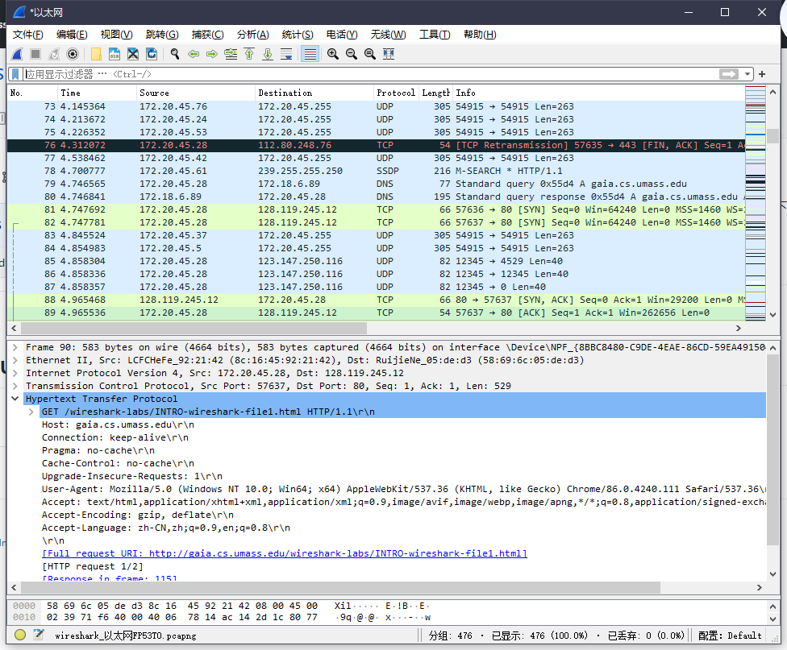
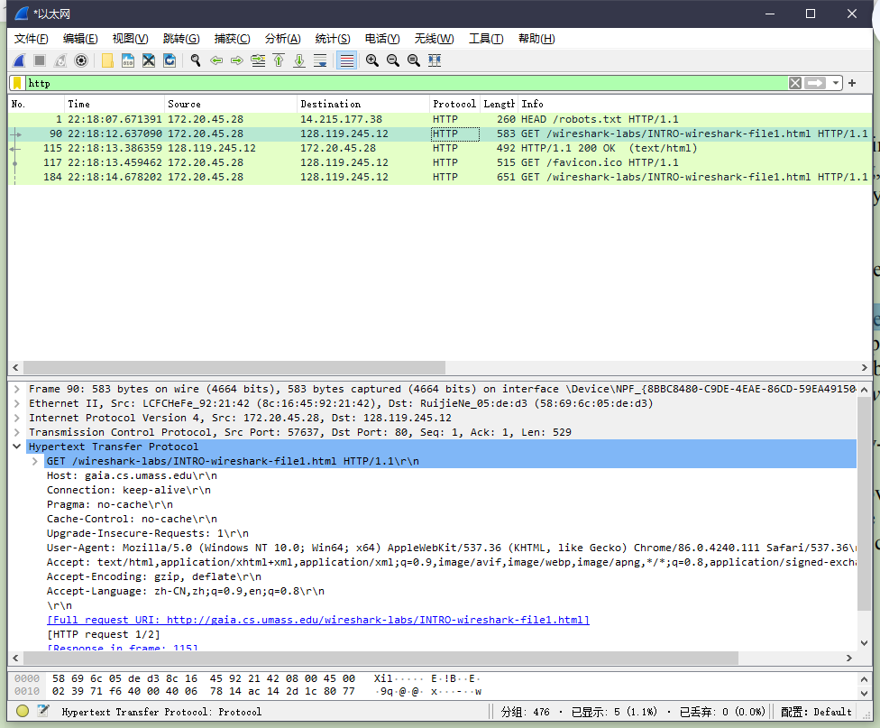

### p1.List 3 different protocols that appear in the protocol column in the unfiltered packet-listing window in step 7 above. 

UDP、TCP、DNS、SSDP



### P2.How long did it take from when the HTTP GET message was sent until the HTTP OK reply was received? (By default, the value of the Time column in the packetlisting window is the amount of time, in seconds, since Wireshark tracing began. To display the Time field in time-of-day format, select the Wireshark *View* pull down menu, then select Time *Display Format*, then select *Time-of-day*.)



从发送HTTP GET请求到接收到OK响应的时间间隔为：13.386359 - 12.637090 = 0.749269s

### P3.What is the Internet address of the gaia.cs.umass.edu (also known as www.net.cs.umass.edu)? What is the Internet address of your computer?

gaia.cs.umass.edu的因特网地址是：128.119.245.12  

自己主机的因特网地址是：172.20.45.28

### P4.Print the two HTTP messages (GET and OK) referred to in question 2 above. To do so, select *Print* from the Wireshark *File* command menu, and select the“*Selected Packet Only”* and *“Print as displayed”* radial buttons, and then click OK.

```http
No. Time Source Destination Protocol Length Info
 90 22:18:12.637090 172.20.45.28 128.119.245.12 HTTP 583 GET /wireshark-labs/INTRO-wireshark-file1.html HTTP/1.1 
Frame 90: 583 bytes on wire (4664 bits), 583 bytes captured (4664 bits) on interface \Device\NPF_{8BBC8480-C9DE-4EAE-86CD-59EA49150410}, id 0
Ethernet II, Src: LCFCHeFe_92:21:42 (8c:16:45:92:21:42), Dst: RuijieNe_05:de:d3 (58:69:6c:05:de:d3)
Internet Protocol Version 4, Src: 172.20.45.28, Dst: 128.119.245.12
Transmission Control Protocol, Src Port: 57637, Dst Port: 80, Seq: 1, Ack: 1, Len: 529
Hypertext Transfer Protocol
 GET /wireshark-labs/INTRO-wireshark-file1.html HTTP/1.1\r\n
 Host: gaia.cs.umass.edu\r\n
 Connection: keep-alive\r\n
 Pragma: no-cache\r\n
 Cache-Control: no-cache\r\n
 Upgrade-Insecure-Requests: 1\r\n
 User-Agent: Mozilla/5.0 (Windows NT 10.0; Win64; x64) AppleWebKit/537.36 (KHTML, like Gecko) Chrome/86.0.4240.111 Safari/537.36\r\n
 Accept: text/html,application/xhtml+xml,application/xml;q=0.9,image/avif,image/webp,image/apng,*/*;q=0.8,application/signed-exchange;v=b3;q=0.9\r\n
 Accept-Encoding: gzip, deflate\r\n
 Accept-Language: zh-CN,zh;q=0.9,en;q=0.8\r\n
 \r\n
 [Full request URI: http://gaia.cs.umass.edu/wireshark-labs/INTRO-wireshark-file1.html]
 [HTTP request 1/2]
 [Response in frame: 115]
 [Next request in frame: 117]
```

```http
No. Time Source Destination Protocol Length Info
 115 22:18:13.386359 128.119.245.12 172.20.45.28 HTTP 492 HTTP/1.1 200 OK (text/html)
Frame 115: 492 bytes on wire (3936 bits), 492 bytes captured (3936 bits) on interface \Device\NPF_{8BBC8480-C9DE-4EAE-86CD-59EA49150410}, id 0
Ethernet II, Src: RuijieNe_05:de:d3 (58:69:6c:05:de:d3), Dst: LCFCHeFe_92:21:42 (8c:16:45:92:21:42)
Internet Protocol Version 4, Src: 128.119.245.12, Dst: 172.20.45.28
Transmission Control Protocol, Src Port: 80, Dst Port: 57637, Seq: 1, Ack: 530, Len: 438
Hypertext Transfer Protocol
 HTTP/1.1 200 OK\r\n
 Date: Sat, 21 Nov 2020 14:18:13 GMT\r\n
 Server: Apache/2.4.6 (CentOS) OpenSSL/1.0.2k-fips PHP/7.4.12 mod_perl/2.0.11 Perl/v5.16.3\r\n
 Last-Modified: Sat, 21 Nov 2020 06:59:02 GMT\r\n
 ETag: "51-5b4987f0954b5"\r\n
 Accept-Ranges: bytes\r\n
 Content-Length: 81\r\n
 Keep-Alive: timeout=5, max=100\r\n
 Connection: Keep-Alive\r\n
 Content-Type: text/html; charset=UTF-8\r\n
 \r\n
 [HTTP response 1/2]
 [Time since request: 0.749269000 seconds]
 [Request in frame: 90]
 [Next request in frame: 117]
 [Request URI: http://gaia.cs.umass.edu/wireshark-labs/INTRO-wireshark-file1.html]
 File Data: 81 bytes
Line-based text data: text/html (3 lines)
```

